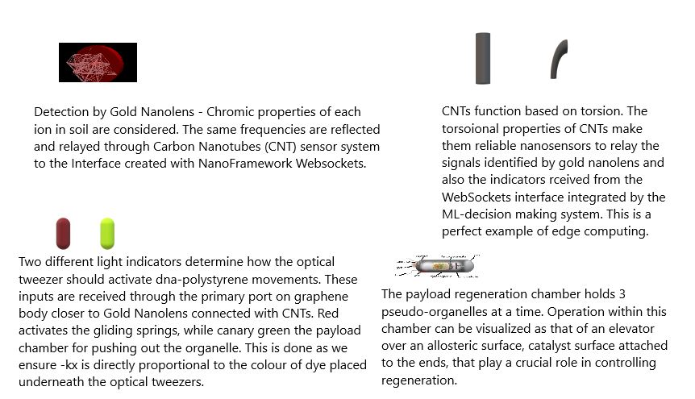

# **DEFENSIVE PUBLICATION: BIOMIMETIC NANOBOTS FOR HEAVY METAL SOIL REMEDIATION**

## **1. Background**
Heavy metal contamination in soil poses a significant environmental challenge, affecting agriculture, groundwater quality, and human health. Existing remediation techniques such as phytoremediation, chemical immobilization, and soil washing are expensive, time-consuming, and often environmentally invasive. 

Advancements in **nanosensors, nanoIoT, and biomimetic nanotechnology** present an opportunity for cost-effective, scalable, and self-sustaining soil decontamination solutions. This defensive publication ensures open access to this technology, preventing restrictive patents that could hinder progress in environmental nanotechnology.

---

## **2. Summary of Invention**
We propose a novel **biomimetic nanobot system** for real-time detection and remediation of heavy metal contaminants in soil. The nanobots integrate **nanosensors, nanoIoT-enabled communication, and self-regenerating mechanisms** to autonomously neutralize metal ions such as **Cd²⁺, Pb²⁺, Ni³⁺, Cu³⁺, and As³⁺**.

### **Key Innovations**
- **Nanosensors for Selective Detection:** Gold nanolens and graphene oxide quantum dots detect and quantify heavy metal presence.
- **NanoIoT Communication System:** Carbon nanotube (CNT)-based wireless nano-network.
- **Self-Regeneration Mechanism:** Internal enzyme-based pseudo-organelles replenish active neutralization agents.
- **Environmentally Safe Decomposition:** Organelles release water and regulate salt solubility index to ensure biodegradability.

---

## **3. Technical Disclosure**

### **3.1 Nanobot Architecture**
The nanobot consists of multiple functional layers:

| Component                          | Function                                                          |
|------------------------------------|------------------------------------------------------------------|
| **Graphene Outer Shell**           | Provides durability and selective permeability.                  |
| **Gold Nanolens**                  | Enables selective ion detection via optical colorimetric sensing. |
| **Polystyrene-DNA Spring Sensors** | Controls movement and enzymatic release.                          |
| **Pseudo-Organelle Payload**       | Bioengineered agents for metal neutralization.                    |
| **NanoIoT Communication System**   | CNT-based wireless nano-network for real-time monitoring.         |
| **Self-Regeneration Chamber**      | Ensures continuous neutralization without human intervention.     |

### **3.2 Operational Cycle**
The nanobot follows a structured eight-step cycle:
1. **Heavy Metal Detection** – Nanosensors detect contaminants via optical and electrochemical signals.
2. **Signal Transmission** – NanoIoT relays contamination data to an IoT dashboard made with NanoFramework WebSockets.
3. **Target Identification** – AI algorithms process data to optimize remediation strategies.
4. **Payload Activation** – Pseudo-organelles release neutralization agents.
5. **Regeneration Cycle** – Self-replenishment of neutralization agents.
6. **Self-Protection** – Protective coating stabilizes the nanobot under varying pH conditions.
7. **Apoptosis Trigger** – Pre-programmed degradation after 1–2 months.
8. **Real-Time Data Logging** – IoT sensors upload data for monitoring and analysis.

---

## **4. Cost-Efficiency Considerations**
The affordability of this nanobot technology is ensured through:
- **Pseudo-Organelle Regeneration:** The self-sustaining bioengineered organelles reduce the need for frequent replenishment of active agents.
- **Alternative to Gold Nanolens:** Investigating cost-effective substitutes such as graphene oxide-based sensors.
- **Bulk Production:** Scaling up manufacturing using microfluidic assembly lines for large-scale deployment.
- **Weight-Based Cost Reduction:** At **1 microgram per nanobot**, material costs are significantly minimized, ensuring affordability at large scales.

---

## **5. Ethical Implications & Responsible Use**

### **5.1 Ethical Regulations & Compliance**
- **Strict Usage Guidelines:** The technology is strictly limited to environmental applications.
- **No Military Applications:** The nanobot cannot be repurposed for destructive or surveillance activities.
- **User Validation System:** Access is restricted to verified researchers and institutions.

### **5.2 Long-Term Environmental Considerations**
- **Biodegradability Assurance:** Decomposition pathways prevent long-term nanobot accumulation.
- **No Genetic Interference:** The nanobot does not interact with soil microbiota at the genetic level.
- **Public Transparency:** All research and developments remain open-source.

---

## **6. Conclusion**
This defensive publication ensures that **biomimetic nanobots with nanosensors and nanoIoT capabilities** remain an **open, non-patentable technology**, facilitating affordable, scalable, and responsible heavy metal remediation solutions.

---

### **License: Apache 2.0**
This publication is released under the **Apache 2.0 license** to encourage open scientific collaboration while preventing proprietary restrictions on environmental nanotechnology.
