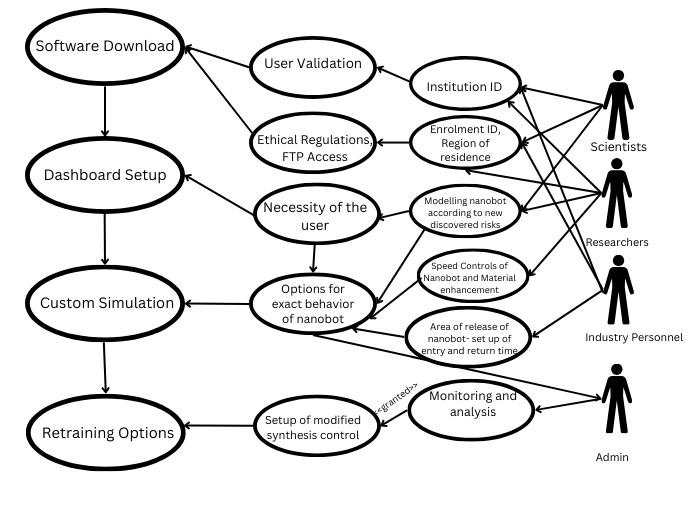
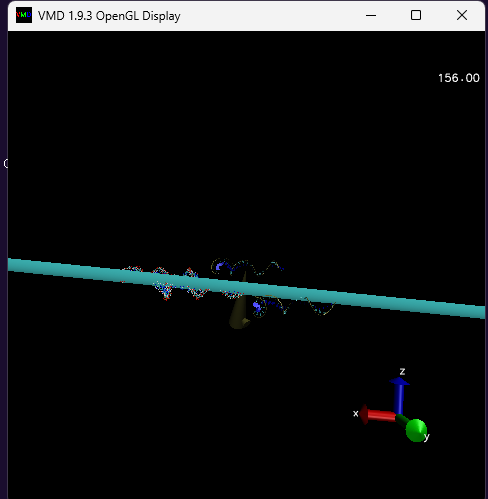
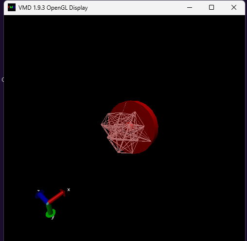

# **Biomimetic Nanobots for Heavy Metal Soil Remediation**

## **1. Overview**

This repository contains a **defensive publication** detailing the design, operation, and computational validation of **biomimetic nanobots** for heavy metal soil remediation. The publication ensures that this technology remains freely available, preventing restrictive patents that could hinder environmental nanotechnology advancements.

## **2. Abstract**

Heavy metal contamination in soil poses severe environmental risks. Existing remediation methods suffer from inefficiencies and high costs. This defensive publication discloses an innovative **biomimetic nanobot system** integrating:

- **Graphene-based outer capsule** for structural integrity.
- **Gold nanolens** for selective ion detection.
- **Pseudo-organelle payload system**, bioengineered for enzymatic neutralization.
- **Self-regenerating mechanism** to replenish active payloads.
- **NanoIoT-enabled communication system** for real-time monitoring and control.

The nanobot autonomously detects and neutralizes heavy metal ions (Cd²⁺, Pb²⁺, Ni³⁺, Cu³⁺, As³⁺) and degrades after a predetermined operational cycle, ensuring eco-friendliness.

### **2.1 Problem: Heavy Metal Contamination**

Heavy metals like arsenic, cadmium, lead, copper, and nickel pose a significant threat to soil health, agriculture, and human well-being. Current remediation methods face the following challenges:
- **Slow Efficiency**: Phytoremediation and bioremediation take years.
- **High Costs**: Electrokinetic and chemical treatments are expensive and energy-intensive.
- **Environmental Risks**: Soil washing and chemical immobilization alter soil pH and cause leaching.

### **2.2 Solution: Nanobot-Based Remediation**

Our approach involves 30-micron biomimetic nanobots designed to navigate soil environments and neutralize heavy metals via targeted interactions. The key features include:
- **Eco-friendly** biological neutralization (pseudo-organelles based on S. aureus sequences).
- Nanobot **self-regeneration** to ensure sustainability of each nanobot for 1–2 months.
- **NanoIoT** and **Edge ML** operation which reduces human intervention.

## **3. Technical Specifications**

### **3.1 Nanobot Structure**

| Component                          | Function                                                          |
| ---------------------------------- | ----------------------------------------------------------------- |
| **Graphene Outer Capsule**         | Provides durability and environmental resilience.                 |
| **Gold Nanolens**                  | Enables selective ion detection via optical colorimetric sensing. |
| **Polystyrene-DNA Spring Sensors** | Controls movement and enzymatic release.                          |
| **Pseudo-Organelle Payload**       | Bioengineered agents for metal neutralization.                    |
| **Self-Regeneration Chamber**      | Ensures continuous neutralization without human intervention.     |
| **IoT Interface**                  | Provides real-time monitoring and control of nanosensor connection|

### **3.2 Mechanism of Action**

The nanobot follows a **five-stage operational cycle**:

1. **Detection** – Gold nanolens detects heavy metal ions.
2. **Signal Transmission** – CNT-based communication relays data to IoT interface.
3. **Neutralization** – Pseudo-organelle payload is released upon nanolaser activation.
4. **Regeneration** – Nanobot synthesizes new pseudo-organelles.
5. **Degradation** – Controlled apoptosis after operational lifespan.

### **3.3 Ethical Implementation and Regulatory Compliance**

To ensure responsible use, the nanobot simulation and deployment follow strict ethical and regulatory guidelines:
1. **User Validation** - Only verified researchers, scientists, and industry personnel can access the simulation.
2. **Ethical Approval** - Users must comply with institutional ethical policies and international safety standards.
3. **Controlled Release** - Deployment in real-world scenarios is restricted to pre-approved research institutions and environmental agencies.
4. **Destruction Prevention** - The nanobot is designed to self-destruct after its operational cycle, preventing misuse for harmful applications.

## **4. Computational Simulations & Performance Metrics**

### **4.1 Molecular Stability & Efficiency (VMD & NAMD Analysis)**

| Property                    | Value          | Significance                                |
| --------------------------- | -------------- | ------------------------------------------- |
| **Binding Energy**          | -75.4 kcal/mol | Strong metal ion interaction                |
| **Stability Index**         | 0.87           | High stability under varied soil conditions |
| **Regeneration Efficiency** | 92.3%          | Effective pseudo-organelle synthesis        |

*****DNA-Polystyrene Sensor attached to graphene: Simulated in VMD*****

### **4.2 Optical Properties of Nanolens**

| Property               | Value | Impact                           |
| ---------------------- | ----- | -------------------------------- |
| **Reflectivity**       | 0.72  | High detection accuracy          |
| **Optical Efficiency** | 85.6% | Effective for ion identification |

*****Gold Nanolens: Simulated in VMD*****

### **4.3 Durability & Structural Resilience**

| Property                   | Value      | Impact                                 |
| -------------------------- | ---------- | -------------------------------------- |
| **Operational Lifespan**   | 1.5 months | Sufficient for soil remediation cycles |
| **Polystyrene Resilience** | 0.91       | Resistant to environmental degradation |

*****Polystyrene Bead: Simulated in VMD*****

## **5. Implementation & Technology Stack**

### **5.1 Implementation Steps**

1. **Nanobot Simulation**: NAMD & Graph Neural Networks for behavior modeling.
2. **ML-Based Action Programming**: Adaptive algorithms for response tuning facilitated through NanoFramework WebSockets.
3. **IoT Integration**: Real-time monitoring & activation using Arduino Cloud.
4. **Biological Payload Synthesis**: Protein sequence optimization via PyG.
5. **3D Printing and 3D Bioprinting**:Pseudo-organelle developement through 3D Bioprinting based on simulation results and integration with *graphene outer capsule*, *dna-polystyrene bead*,*optical tweezer system*, *gold nanolens* through 3D Printing.
6. **Field Testing & Deployment**: Pilot testing in contaminated soil conditions.

### **5.2 Technology Stack**

| Technology                      | Purpose                                                          |
| ------------------------------- | ---------------------------------------------------------------- |
| **VMD**                         | Biopolymer simulation, analysis, and visualization.              |
| **NAMD**                        | Molecular dynamics simulations with quantum chemistry support.   |
| **PyG (Graph Neural Networks)** | Optimizing enzyme catalysis and solubility control.              |
| **Arduino Cloud**               | Integrating nanosensors for real-time soil condition monitoring. |
| **NanoFramework WebSockets**    | Real-time sensor triggering with AI algorithm driven operations. |

## **6. Applications & Use Cases**

- **Agricultural Soil Remediation**: Detoxifying farmland from industrial contamination.
- **Urban & Mining Land Restoration**: Enabling safe redevelopment of polluted sites.
- **E-Waste Management**: Potential adaptation for breaking down electronic waste components.

## **7. Feasibility & Challenges**

### **7.1 Showstoppers & Mitigation Strategies**

- **Reaction Area Control**: Ensuring precise neutralization without secondary pollution.
- **Heavy Metal Reabsorption Risk**: Mitigating reabsorption by plants using solubility control.
- **Cost Optimization**: Exploring alternatives to expensive nanomaterials like gold.

## **8. Contribution & Future Updates**

This repository will be continuously updated with **new defensive publications, additional research papers, and datasets**. Contributions are welcome from researchers and enthusiasts in nanotechnology, AI-driven environmental solutions, and quantum-enhanced simulations.

### **How to Contribute?**

- **Submit pull requests** for improvements, error corrections, or adding references.
- **Open issues** to discuss potential improvements or request additional research.
- **Upload new simulations/data** for validation.

## **9. Licensing & Open Access**

This work is licensed under **Apache License 2.0**. You may use, modify, and distribute it under the terms of the Apache 2.0 license. See the LICENSE file for more details to ensure unrestricted access and prevent patenting.

## **10. Authors & Contact**

- **Suma Mallapragada**, Former Research Intern, IEEE Nanotechnology Council Young Professionals Region 10.
- **Vaishnavi Sankepally**, Student Intern, SK AI Pvt Ltd.\
  **Publication Date**: July 2024

---

---

